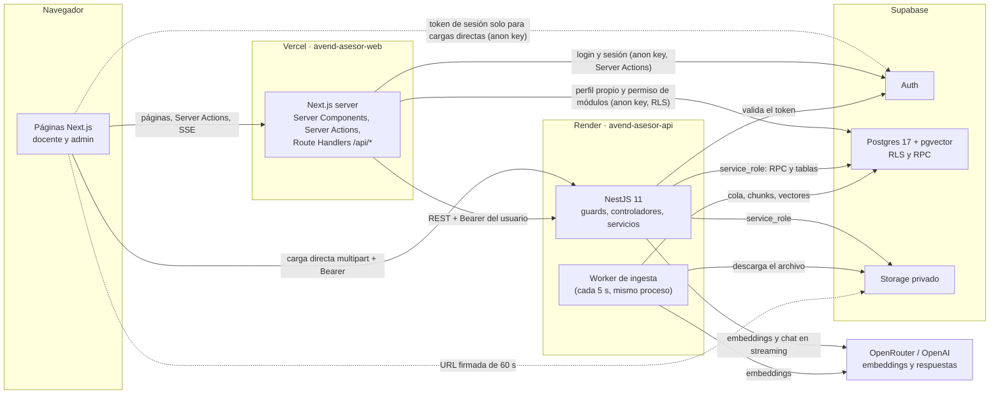
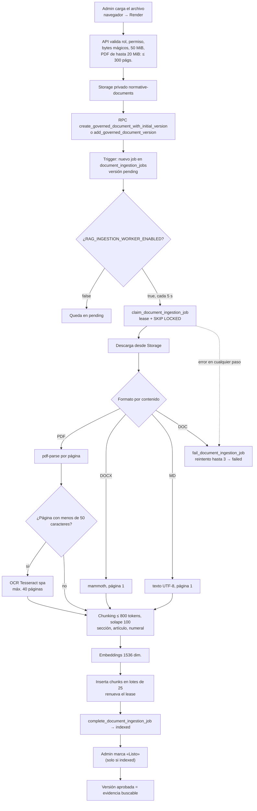
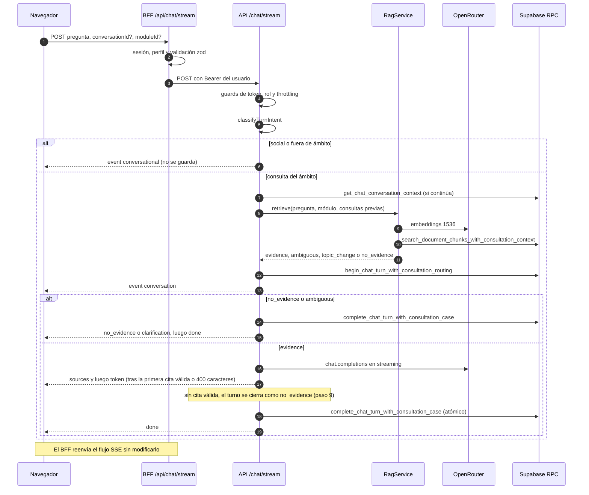

# Arquitectura de software — AVEND ASESOR

**Estado:** vigente al 2026-09-25 (rama `main` después de los PR #58 y #59).
Reemplaza la versión del 2026-08-23, que era anterior a la activación del RAG,
a la capa conversacional y al Hito 4.

**Alcance:** describe el sistema tal como existe en el código. Donde un dato
operativo (costos, responsables, planes) no se puede comprobar desde el
repositorio, se indica **Por confirmar (PO)**.

---

## 1. Visión general

AVEND ASESOR es un asistente de consulta para docentes, auxiliares de educación
y directivos del sector educativo peruano. Responde con **evidencia
documental**: solo afirma lo que está en documentos normativos cargados por la
administración, los cita y, si no hay sustento, lo dice (principio
*evidence-only fail-closed*).

**Estilo:** monolito modular. Hay un solo backend NestJS, dividido en módulos
por dominio, y un frontend Next.js separado. Ambos se apoyan en Supabase para
identidad, base de datos, vectores y archivos. No hay microservicios. Un
componente solo se extraería con evidencia real: carga independiente, necesidad
de escalar por separado o aislamiento crítico.

**Regla de reparto:** Vercel aloja solo la interfaz y un BFF (*backend for
frontend*) delgado. **Toda la lógica de negocio, el acceso a datos, Storage y el
RAG viven en el API de Render.**

| Componente | Tecnología | Hospedaje | Responsabilidad |
| --- | --- | --- | --- |
| Web (`apps/web`) | Next.js 16, React 19, TypeScript, Tailwind 4 | Vercel, proyecto `avend-asesor-web` | UI, sesión en cookies y BFF server-only que reenvía peticiones al API con el token del usuario |
| API (`apps/api`) | NestJS 11 sobre Node 24 | Render, servicio `avend-asesor-api` | Autenticación y autorización, reglas de negocio, RAG, ingesta, Storage |
| Worker de ingesta | Parte del mismo proceso del API (`IngestionWorker`) | Render (misma instancia) | Extraer, trocear, vectorizar e indexar documentos |
| Base de datos | Supabase Postgres 17 + `pgvector` | Supabase | Datos relacionales, vectores, RLS y RPC |
| Identidad | Supabase Auth | Supabase | Registro, login, confirmación de correo, recuperación |
| Archivos | Supabase Storage (buckets privados) | Supabase | Documentos normativos y adjuntos de consultas |
| IA | Gateway compatible con la API de OpenAI | OpenRouter (OpenAI si falta la clave de OpenRouter) | Embeddings (`text-embedding-3-small`, 1536 dim.) y respuestas (`gpt-4o-mini`) |

### 1.1 Diagrama de componentes

### 1.2 Estructura del repositorio

| Ruta | Contenido |
| --- | --- |
| `apps/api` | API NestJS (`src/<dominio>/`), pruebas Jest (`*.spec.ts`), E2E (`test/`) y arnés de aceptación del Hito 3 (`test/acceptance/`) |
| `apps/web` | App Next.js (`src/app`, `src/components`, `src/lib`), pruebas Vitest |
| `packages/shared` | Paquete `@avend/shared`; hoy está vacío y ninguna app lo usa |
| `supabase/` | `config.toml`, migraciones (`migrations/`, 51 archivos) y contratos pgTAP (`tests/database/`, 22 archivos) |
| `infrastructure/` | Runbooks sin secretos: `supabase/`, `email/`, `mailpit/`, `qa/` y scripts PowerShell de verificación local (`local/Test-LocalHito*Closure.ps1`) |
| `scripts/` | Siembra y verificación de datos de demostración (`npm run demo:*`; ver `docs/database/DEMO_SEED.md`) |
| `.github/workflows/ci.yml` | CI: lint, tipos, pruebas con cobertura, E2E, build y verificación de artefactos |

Es un monorepo con **npm workspaces** (`package.json` raíz). Exige Node
`>=24.14.0 <25` y npm `>=11.16.0 <12`; `.nvmrc` fija `24.14.0`.

---

## 2. Frontend (`apps/web`)

### 2.1 Rutas

| Ruta | Carpeta | Acceso | Función |
| --- | --- | --- | --- |
| `/` | `src/app/page.tsx` | Público | Portada con acceso a registro e inicio de sesión |
| `/auth/sign-in`, `sign-up`, `forgot-password`, `update-password`, `confirmed`, `code-error`; `/auth/callback`, `/auth/sign-out` | `src/app/auth` | Público | Flujos de Supabase Auth mediante Server Actions y Route Handlers |
| `/chat`, `/chat/[conversationId]` | `src/app/chat` | docente, admin, superadmin | Chat con streaming; retomar una conversación |
| `/chat/[conversationId]/orientacion/[messageId]` | `src/app/chat` | Mismos roles | Vista previa de la ficha de orientación (CU-14, ver `docs/requirements/CU14_FICHA_ORIENTACION.md`) |
| `/history`, `/guide`, `/profile` | `src/app/(teacher)` | Mismos roles | Historial propio, guía de uso y perfil |
| `/admin` | `src/app/admin` | admin, superadmin | Inicio del panel con métricas |
| `/admin/modules[/moduleId]`, `/admin/documents[/id]` | `src/app/admin` | admin, superadmin con permiso de módulos | Jerarquía de módulos, biblioteca y carga de documentos |
| `/admin/operations[/caseId]` | `src/app/admin` | admin, superadmin | Bandeja de consultas y casos de revisión |
| `/admin/users` | `src/app/admin` | superadmin | Usuarios, importación, exportación y auditoría |
| `/access-denied` | `src/app` | Autenticado sin permiso | Aviso de acceso denegado |

`(teacher)` es un *route group*: comparte el marco lateral (`TeacherShell`) sin
agregar un segmento a la URL. `/chat` queda fuera del grupo y renderiza su
propio marco. El layout de `/admin` monta la barra lateral una sola vez.

**Los layouts no autorizan.** Un layout de Next.js no vuelve a ejecutarse al
navegar entre páginas hijas, así que cada página revalida su acceso (comentarios
en `src/app/(teacher)/layout.tsx` y `src/app/admin/layout.tsx`).

### 2.2 Frontera server-only

- Los módulos que tocan tokens o el API importan `server-only`:
  `client.ts`, `authorized-client.ts` y `config.ts` de `src/lib/admin-api/`;
  `client.ts` y `authorized-client.ts` de `src/lib/chat-api/` y de
  `src/lib/consultation-reports-api/`; `src/lib/supabase/server.ts` y
  `src/lib/orientation-document/builders.ts`. Un import accidental desde un
  componente de cliente rompe el build.
- Como variables de entorno, el navegador solo recibe
  `NEXT_PUBLIC_SUPABASE_URL` y `NEXT_PUBLIC_SUPABASE_ANON_KEY`. `ADMIN_API_URL`
  no lleva el prefijo `NEXT_PUBLIC_`. Se valida en `src/lib/admin-api/config.ts`:
  debe ser un origen HTTPS (o `http` en loopback), sin credenciales, ruta, query
  ni hash. El servidor solo pasa ese origen ya validado, como prop, a los dos
  formularios de carga directa (§2.4).
- La clave `service_role` de Supabase **nunca** llega a la web.

### 2.3 Sesión y autorización en la web

- `src/proxy.ts` es el *proxy* de Next.js 16 (antes *middleware*). Llama a
  `updateSupabaseSession` en cada petición (salvo recursos estáticos e
  imágenes, según su `matcher`) para refrescar las cookies de sesión de
  `@supabase/ssr`.
- `src/lib/authorization/resolve-chat-access.ts` obtiene el usuario
  (`auth.getUser`) y lee su propia fila de `profiles`, que RLS permite. Exige:
  rol de chat, `account_status = 'active'`, `access_expires_at` vigente y nombre
  no vacío.
- `src/lib/authorization/resolve-admin-access.ts` exige además rol
  `admin`/`superadmin` y consulta el RPC `current_user_has_admin_module_access()`.
- Esto solo filtra la experiencia. **La autoridad real es el API**, que repite
  todas las comprobaciones con cada petición.

### 2.4 BFF y Route Handlers

Las páginas son Server Components y llaman al API desde el servidor de Vercel
con el token del usuario (`src/lib/*-api/client.ts`). Las mutaciones pequeñas
son Server Actions que solo reenvían al API. Route Handlers:

| Handler | Método | Qué hace |
| --- | --- | --- |
| `/api/chat/stream` | POST | Valida sesión, perfil y cuerpo (zod), llama a `POST /chat/stream` y devuelve el cuerpo SSE **sin modificarlo** |
| `/api/chat/sources/[sourceId]/download?pagina=N` | GET | Pide al API una URL firmada y redirige (307) a ella con `#page=N` |
| `/api/chat/conversations/[conversationId]/messages/[messageId]/orientacion/[format]` | POST | Genera la ficha de orientación en PDF (`pdfkit`) o DOCX (`docx`) a partir de la conversación que devuelve el API |
| `/api/consultation-feedback/reports`, `/suggestions` | POST | Reporte o sugerencia del docente, con adjunto opcional; acota el cuerpo a 10 MiB + 128 KiB antes de parsearlo |
| `/api/admin/documents/[id]/access` | GET | Acceso administrativo a un documento mediante URL firmada |
| `/api/admin/consultation-cases/[caseId]/attachments/[attachmentId]/download` | GET | Descarga de un adjunto de caso |
| `/api/admin/users/export` | GET | Exportación del directorio de usuarios |

**Excepción deliberada:** los archivos grandes van del navegador directo a
Render, sin pasar por Vercel, porque los límites de cuerpo de Server Actions y
funciones de Vercel son menores que 50 MiB. Son dos formularios:
`src/components/admin/document-pdf-upload-form.tsx` (documentos) y
`src/components/admin/users-import-form.tsx` (importación de usuarios).
El navegador obtiene su token de la sesión de Supabase y envía `multipart` con
`Authorization: Bearer` y `credentials: 'omit'`. El API revalida token, rol,
permiso y contenido, y su CORS solo admite `WEB_ORIGIN`.

---

## 3. Backend (`apps/api`)

### 3.1 Arranque y configuración global

- `src/main.ts` escucha en `0.0.0.0:PORT`.
- `src/application.factory.ts` aplica `helmet()`, CORS con `origin: WEB_ORIGIN`
  y un `ValidationPipe` global con `whitelist`, `forbidNonWhitelisted` y
  `transform`.
- `src/app.module.ts` configura:
  - `ConfigModule` global, validado con zod en
    `src/config/environment.validation.ts`;
  - `ThrottlerModule`, con 30 peticiones/60 s por defecto. Los controladores,
    salvo `/health`, aplican `ThrottlerGuard` con su propio límite (por ejemplo, 10/min en
    `POST /chat/stream`, 5/min en cargas de documentos y 3/min en la
    importación de usuarios);
  - `ScheduleModule`, que usa el worker.
- **No hay OpenAPI/Swagger.** La referencia de endpoints son los controladores
  (`src/**/*.controller.ts`) y sus DTO (`src/**/dto/`).

### 3.2 Módulos NestJS

Lista tomada de `src/*/*.module.ts`:

| Módulo | Responsabilidad | Endpoints | Roles |
| --- | --- | --- | --- |
| `AuthModule` | Verifica el access token contra Supabase Auth (`AuthService`) | — | — |
| `AuthorizationModule` | `AuthorizationGuard` (Bearer → identidad → perfil activo, no vencido, correo confirmado), `RolesGuard` (`@RequireRoles`) y `FeaturesGuard` (`@RequireFeatures('modules')`) | — | — |
| `UsersModule` | Lectura de perfiles y registro de último acceso | — | — |
| `SupabaseModule` | Cliente de servidor único con `service_role` y un adaptador (*gateway*) por dominio | — | — |
| `HealthModule` | Liveness y readiness (prueba `profiles` con timeout de 3 s) | `GET /health`, `GET /health/ready` | Público |
| `ChatModule` | Turno de chat SSE, historial, módulos visibles y descarga de fuentes | `/chat/*` | docente, admin, superadmin |
| `RagModule` | Recuperación y ruteo (`RagService`), generación (`OpenAiAnswerGateway`) y verificación del RPC al arrancar (`RetrievalContractProbe`) | — | — |
| `IngestionModule` | Worker, extracción PDF/DOCX/MD, OCR, chunking y embeddings | — | — |
| `LearningModule` | Memoria FAQ gobernada; lo importa `ChatModule`, no `AppModule` | `/admin/rag/faq-memory/*` | admin, superadmin |
| `RagAdminModule` | Estado operativo del RAG: worker, proveedor, modelos, umbral y conteos | `GET /admin/rag/readiness` | admin, superadmin |
| `DocumentsModule` | Documentos, versiones, situación, estado técnico, módulos y descargas | `/admin/documents/*` | admin, superadmin con permiso de módulos |
| `ModulesModule` | Jerarquía de módulos (dos niveles) | `/admin/modules/*` | admin, superadmin con permiso de módulos |
| `ModulePermissionsModule` | Otorga o retira el permiso de módulos a administradores | `/admin/module-permissions` | superadmin |
| `OperationsModule` | Métricas y consultas sin sustento | `/admin/operations/*` | admin, superadmin |
| `ConsultationCasesModule` | Reportes y sugerencias docentes; bandeja y tablero de casos | `/consultation-cases/*`, `/admin/consultation-cases/*` | docente, admin, superadmin (reportes y sugerencias); admin, superadmin (bandeja) |
| `AdministrationModule` | Tablero de inicio y verificación de acceso | `/admin/dashboard`, `/admin/access`, `/admin/system` | admin, superadmin (`system`: solo superadmin) |
| `UserAdministrationModule` | Alta, importación, exportación, ventana de acceso y auditoría operativa | `/admin/users/*` | superadmin |

### 3.3 Patrones internos

- **Controlador → servicio → gateway.** Los servicios dependen de interfaces
  (`*.gateway.ts`) inyectadas por token (`supabase.constants.ts`,
  `rag.tokens.ts`, `ingestion.tokens.ts`). Las implementaciones están en
  `src/supabase/supabase-*.gateway.ts` y en los gateways de IA. Así las pruebas
  usan dobles sin red ni claves.
- **Sin ORM.** La persistencia usa `@supabase/supabase-js` con `service_role`,
  casi siempre mediante RPC de Postgres que concentran validación, auditoría y
  atomicidad.
- **Errores seguros.** Los fallos externos se traducen a excepciones HTTP
  genéricas, sobre todo `503`, sin detalles internos. En el chat, un fallo a
  mitad del stream emite `event: error` con `CHAT_STREAM_FAILED` y registra el
  fallo técnico (`record_consultation_technical_failure`).

---

## 4. Base de datos (Supabase)

### 4.1 Motor y esquemas

- Postgres 17 (`supabase/config.toml`, `major_version = 17`). Extensiones
  `vector`, `pg_trgm` y `unaccent` en el esquema `extensions`.
- `public`: tablas de aplicación y RPC. La Data API expone solo `public` y
  `graphql_public` (`config.toml`).
- `private`: funciones de triggers y helpers internos (por ejemplo,
  `private.require_administrator`). Tiene `revoke all ... from public`, y ni
  `service_role` (con el que el API invoca las RPC) ni `authenticated` tienen
  `USAGE` sobre él. Consecuencia: **una RPC `security invoker` que invoca
  el API no debe llamar `private.*` en su camino normal**. Las RPC
  `security definer` (se ejecutan como su propietario) y los triggers sí pueden
  hacerlo. La migración `20260910130000_inline_document_mime_type.sql` documenta
  la regresión que causó romper esta regla: todas las cargas respondían 503.

### 4.2 Tablas por dominio

| Dominio | Tablas |
| --- | --- |
| Identidad | `profiles` (1:1 con `auth.users`; rol `superadmin` / `admin` / `docente`; estado; ventana de acceso) |
| Organización | `modules` (jerarquía de dos niveles, baja lógica), `admin_module_permissions`, `admin_module_permission_events` |
| Documentos | `documents` (situación `current` / `replaced` / `archived`, estado técnico, `approved_version_id`), `document_versions` (inmutables), `document_modules`, `document_audit_events` |
| Ingesta y vectores | `document_ingestion_jobs` (cola con lease e intentos), `document_chunks` (texto, páginas, sección, artículo, numeral, `tsvector`, `embedding vector(1536)`) |
| Chat | `chat_conversations`, `chat_messages`, `chat_message_sources`, `chat_source_access_events` |
| Calidad y consultas | `consultation_cases`, `consultation_turns`, `consultation_case_sources`, `consultation_case_events`, `consultation_case_attachments`, `consultation_case_document_links`, `unanswered_questions`, `unanswered_question_reviews` |
| Memoria FAQ | `faq_memory_candidates`, `faq_memory_observations`, `faq_memory_reviews` |
| Auditoría | `operational_audit_events`, además de `document_audit_events` y los eventos de permisos y de casos |

Índices de búsqueda: HNSW (`vector_cosine_ops`) sobre
`document_chunks.embedding` y GIN sobre `content_tsv`
(`20260821064610_create_hito3_rag_foundation.sql`). El detalle de columnas,
índices y *hardening* está en
[`MAPA_BASE_DE_DATOS_Y_HARDENING.md`](MAPA_BASE_DE_DATOS_Y_HARDENING.md).

### 4.3 Modelo de seguridad de datos

- **RLS activado en todas las tablas de aplicación.** La única política
  permisiva deja que un usuario autenticado lea **su propio** perfil. Las demás
  tablas no tienen políticas para `anon` ni `authenticated`, así que se les
  niega el acceso; además se revocan los privilegios de forma explícita.
- **RPC restringidas a `service_role`.** Las RPC de chat, ingesta, recuperación
  y administración revocan `execute` a `public`, `anon` y `authenticated` y lo
  conceden solo a `service_role`. Las de chat, ingesta y recuperación son
  `security definer`; las documentales, `security invoker`. Todas fijan
  `search_path = ''`.
- **Propiedad (*owner-only*) dentro de la RPC.** Las RPC de historial reciben
  `p_user_id` y filtran por propietario. Por ejemplo, `get_chat_conversation`
  exige `user_id = p_user_id and not is_deleted`. Una conversación o cita ajena
  responde como inexistente (`P0002`, que el API traduce a 404).
- **Única RPC para `authenticated`:** `current_user_has_admin_module_access()`.
  Solo devuelve un booleano sobre el propio usuario (`auth.uid()`) y la usa la
  web para mostrar la navegación del panel.
- **Triggers de integridad (en `private`):**
  - `handle_new_user` crea el perfil con rol `docente`; el rol nunca se toma de
    `user_metadata`.
  - Otros triggers impiden mutar versiones y auditorías, validan la jerarquía de
    módulos y encolan la ingesta al insertar una versión.
  - `validate_chat_message_source_live_evidence` revalida, al guardar una cita,
    que el fragmento siga siendo evidencia vigente.

### 4.4 Storage

| Bucket | Privado | Límite | Tipos | Definido en |
| --- | --- | --- | --- | --- |
| `normative-documents` | Sí | 50 MiB | PDF, DOCX, DOC, Markdown | `20260809194717_create_document_management_foundation.sql` y `20260910120000_document_upload_formats_and_size.sql` |
| `consultation-case-attachments` | Sí | 10 MiB | JPEG, PNG, WebP, PDF, DOC, DOCX | `20260905100000_consultation_reports_and_quality.sql` |

Políticas restrictivas niegan el acceso directo a `anon` y `authenticated`.
Solo el API sube y descarga con `service_role`. Al usuario se le entregan URLs
firmadas de **60 segundos**: fuentes del chat, descarga administrativa y
adjuntos de casos.

### 4.5 Migraciones y contratos

- Fuente de verdad: `supabase/migrations/`. Los contratos pgTAP de
  `supabase/tests/database/` se ejecutan con `supabase test db --local`, dentro
  de los scripts `infrastructure/local/Test-LocalHito*Closure.ps1`. **El CI de
  GitHub no ejecuta pgTAP.**
- Una migración se aplica en producción **antes** de desplegar el código que la
  usa. Fusionar a `main` despliega, así que el orden importa.
- Nunca se ejecuta `supabase db push` desde un árbol de trabajo: aplicaría
  migraciones no autorizadas.
- Si el RPC de recuperación falta o cambió de firma, `RetrievalContractProbe`
  lo registra como error al arrancar. El nombre y la firma se declaran en
  `src/rag/retrieval.constants.ts`.

---

## 5. Pipeline RAG

### 5.1 Ingesta

1. Un administrador carga el archivo (navegador → `POST /admin/documents` o
   `POST /admin/documents/:id/versions`).
2. El API valida:
   - rol y permiso de módulos;
   - bytes mágicos del archivo;
   - tamaño de hasta 50 MiB;
   - en los PDF de hasta 20 MiB, que tengan entre 1 y 300 páginas. Un PDF de
     más de 20 MiB no se analiza, para no agotar la memoria de la instancia, y
     se guarda sin conteo de páginas ni tope de 300
     (`src/documents/pdf-inspection.service.ts`, `MAX_PDF_PARSE_BYTES`).
3. El API sube el archivo al bucket privado y llama a
   `create_governed_document_with_initial_version` o
   `add_governed_document_version`. Si la RPC falla, borra el objeto subido
   (compensación).
4. El trigger `private.enqueue_document_version_ingestion` crea un trabajo en
   `document_ingestion_jobs`. La versión queda en `pending`.
5. Si `RAG_INGESTION_WORKER_ENABLED=true`, el worker (`src/ingestion/`) sondea
   la cola cada 5 s y toma un trabajo con
   `claim_document_ingestion_job`:
   - usa lease (`RAG_INGESTION_LEASE_SECONDS`, 300 s por defecto) y
     `FOR UPDATE SKIP LOCKED`;
   - admite hasta 3 intentos.
6. Extracción según el formato, que se detecta por contenido
   (`src/ingestion/document-format.ts`):
   - **PDF:** `pdf-parse` página por página. Las páginas con menos de 50
     caracteres útiles pasan por **OCR local** con Tesseract (`tesseract.js`,
     idioma `spa`): hasta 40 páginas por trabajo, en lotes de 5.
   - **DOCX:** `mammoth`, con guardas de memoria (48 MiB de XML y 5 millones de
     caracteres). Todo el texto queda como página 1.
   - **Markdown:** texto UTF-8 (página 1).
   - **DOC** (formato binario antiguo): se acepta en la carga, pero la ingesta
     no tiene extractor y lo rechaza (mensaje `INGESTION_UNSUPPORTED_FORMAT`).
     Al agotar los reintentos, el trabajo termina en `failed`.
7. Chunking (`chunking.service.ts`):
   - tokenizador `o200k_base` (`js-tiktoken`);
   - hasta 800 tokens por fragmento, con solapamiento de 100;
   - respeta títulos, artículos y numerales, y conserva páginas y sección.
8. Embeddings de 1536 dimensiones. Un vector de otra dimensión aborta el
   trabajo.
9. El worker reemplaza los fragmentos de la versión en lotes de 25, renovando
   el lease, y cierra con `complete_document_ingestion_job`, que deja la versión
   en `indexed`. Ante un error llama a `fail_document_ingestion_job`, que la
   reintenta o la marca `failed`. Para reencolar una versión existe la RPC
   `retry_document_ingestion`. El API no la expone: se ejecuta a mano con
   `service_role` (ver
   [`../hito3/RUNBOOK_ACTIVACION_EJE_B.md`](../hito3/RUNBOOK_ACTIVACION_EJE_B.md)).
10. **Aprobación.** Un administrador marca el estado técnico «Listo»
    (`PATCH /admin/documents/:id/technical-status`). La RPC
    `set_document_technical_status` solo lo permite si la versión está
    `indexed`, y fija `approved_version_id`. **Solo la versión aprobada es
    evidencia.**

### 5.2 Consulta: turno de chat

Implementación en `src/chat/chat.service.ts` (`stream`) y
`src/rag/rag.service.ts` (`retrieve`):

1. **Clasificador de intención** (`src/chat/intent/intent-classifier.ts`).
   Decide sin IA ni embeddings entre tres carriles: `social` (saludo,
   agradecimiento, acuse, despedida, anuncio o «¿qué puedes hacer?»),
   `out_of_scope` o `domain`. Ante cualquier señal del dominio o duda elige
   `domain` (*fail-closed*). Los carriles social y fuera de ámbito responden con
   un evento `conversational` **efímero**: no activan el RAG ni guardan nada.
2. **Consulta sin tema.** Si es la primera consulta, no hay módulo elegido y
   no nombra un trámite (por ejemplo, «¿Cuáles son los requisitos?»), el API
   pide precisar y ofrece hasta 8 módulos raíz como opciones. No busca todavía.
   El turno sí se guarda como aclaración, para que la respuesta del usuario
   conserve la pregunta original.
3. **Contexto.** Si el turno continúa una conversación, carga el historial con
   `get_chat_conversation_context`: hasta 12 mensajes y 10 000 caracteres.
   Una frase como «otra consulta: …» o un cambio manual de módulo empieza una
   conversación nueva.
4. **Recuperación** (`RagService.retrieve`):
   - Detecta el alcance temporal: `current`, `historical` o
     `archived_explicit`.
   - Si la pregunta es un seguimiento elíptico («¿y el plazo?»), agrega las
     consultas previas del usuario.
   - Vectoriza y llama a `search_document_chunks_with_consultation_context`.
     Siempre hace una búsqueda global y, si hay módulo, otra acotada a él.
   - Filtros del RPC: documento no eliminado, sin marca `demoSeed`, versión
     aprobada e `indexed`, módulo activo y situación documental acorde al
     alcance.
5. **Ruteo por fuentes dominantes.** Solo cuentan las fuentes a menos de 0,08
   del mejor puntaje. El resultado es uno de cuatro:
   - `evidence`: se infiere el módulo;
   - `ambiguous`: las fuentes dominantes apuntan a módulos sin ninguno en
     común;
   - `topic_change`: otro módulo supera al actual por al menos 0,08;
   - `no_evidence`.

   **El módulo es contexto de ruteo, no una barrera por usuario:** cualquier
   rol de chat consulta todo el corpus.
6. **Se abre el turno** con `begin_chat_turn_with_consultation_routing` y se
   emite el evento `conversation`.
7. **Sin evidencia o ambigua.** El API **no llama al modelo**. Guarda un
   mensaje `no_evidence` o `clarification` y registra la consulta para revisión.
   En la aclaración cita fuentes de «orientación inicial» solo si superan el
   umbral por 0,07.
8. **Con evidencia:**
   - el API genera antes un UUID por cita;
   - llama al modelo en streaming con `temperature: 0` y hasta 1 500 tokens;
   - el *system prompt* evidence-only está en `src/rag/prompt.builder.ts`;
   - fuentes e historial van en el mensaje de usuario, dentro de bloques
     marcados como **datos no confiables**, y se neutralizan los marcadores
     reservados.
9. **Control *fail-closed* de citas** (`src/rag/citations.ts` y
   `src/rag/no-support-marker.ts`). No se muestra nada hasta ver una cita
   `[n]` válida o 400 caracteres. El turno se cierra como «sin evidencia» si
   ocurre cualquiera de estas situaciones:
   - el modelo empieza con la marca `[[SIN_SUSTENTO]]`;
   - emite esa marca después de un texto que todavía no cita ninguna fuente;
   - la respuesta final no cita ninguna fuente entregada (`[2012]` no cuenta
     como cita).
10. **Cierre atómico** con `complete_chat_turn_with_consultation_case`. En la
    misma transacción se revalidan las citas contra evidencia vigente, se
    guardan instantáneas de las fuentes y se crea el caso de calidad cuando
    corresponde.

    Las señales de calidad se calculan de forma determinista en
    `chat.service.ts`:
    - `support_partial`: hay afirmaciones sin cita, o el modelo emitió la marca
      de «sin sustento» después de una parte citada;
    - `citation_insufficient`: una cita no respalda la afirmación o una cifra
      no figura en la fuente;
    - `low_confidence`: el mejor puntaje no supera el umbral en 0,05 o más.

    Una desconexión no guarda texto parcial.
11. **Memoria FAQ** (`src/learning/`). Si existe
    `FAQ_MEMORY_FINGERPRINT_SECRET`, agrega huellas HMAC de preguntas
    terminadas para revisión humana. **Nunca es fuente de respuestas.**
    Detalle en [`MEJORA_CONTINUA_RAG.md`](MEJORA_CONTINUA_RAG.md).

### 5.3 Contrato SSE de `POST /chat/stream`

| Evento | Cuándo | Contenido |
| --- | --- | --- |
| `conversational` | Turno social o fuera de ámbito | `message` y, a veces, `startsNewTopic` |
| `conversation` | Al abrir un turno guardado | `conversationId`, `moduleId`, `startedNewConversation`, `userMessageId` |
| `sources` | Antes del primer fragmento de respuesta o en una aclaración con orientación | Fuentes con UUID, documento, versión, páginas, sección, artículo, numeral, situación y relevancia |
| `token` | Durante la respuesta | `text` |
| `clarification` | Consulta ambigua o sin tema | `message` y `modules` sugeridos |
| `no_evidence` | Sin sustento | `message` |
| `done` | Fin del turno | `messageId`, `inReplyToMessageId`, `provider` (`openai` si respondió el modelo, aunque sea vía OpenRouter; `rule` si respondió una regla) |
| `error` | Fallo técnico a mitad del stream | `code: CHAT_STREAM_FAILED` |

La web valida estos eventos con zod (`src/lib/chat-api/types.ts`).

### 5.4 Parámetros del RAG

| Parámetro | Valor | Dónde |
| --- | --- | --- |
| Umbral de similitud | `0.5`, configurable con `RAG_MATCH_THRESHOLD`; calibrado con el corpus real el 2026-09-23 | `src/rag/rag.constants.ts` |
| Fuentes entregadas | `RAG_MATCH_COUNT` (5); se buscan hasta el doble, con máximo 10 | `rag.service.ts` |
| Margen de ruteo / cambio de tema / banda de fuentes / orientación | 0,08 / 0,08 / 0,12 / 0,07 | `rag.constants.ts` |
| Contexto conversacional | 12 mensajes, 10 000 caracteres y 2 000 por mensaje | `rag.constants.ts` |
| Pregunta | 1 a 8 000 caracteres | `src/chat/dto/stream-chat.dto.ts` |
| Respuesta | 1 500 tokens y 20 000 caracteres; si se corta, se agrega un aviso | `rag.constants.ts`, `chat.service.ts` |
| Mensajes al retomar una conversación | 100 | `chat.service.ts` |

Contexto adicional:
[`SISTEMA_RAG.md`](SISTEMA_RAG.md),
[`CONTEXTO_CONVERSACIONAL_Y_CITAS_PRIVADAS.md`](CONTEXTO_CONVERSACIONAL_Y_CITAS_PRIVADAS.md)
y [`../hito3/VALIDACION_INTEGRAL_HITO3.md`](../hito3/VALIDACION_INTEGRAL_HITO3.md).

---

## 6. Servicios externos

| Servicio | Uso | Identificador / configuración conocida | Plan, costo y responsable |
| --- | --- | --- | --- |
| Supabase | Auth, Postgres, pgvector, Storage | Producción: `blxrdotroysitfyehmqw` (AVENDSESOR, us-west-2, Postgres 17). Staging: `scepelftmjlabepygrri` (avend-asesor-staging, us-east-2) | Plan Free, **sin PITR**. Costo y titular de la cuenta: Por confirmar (PO) |
| Render | API NestJS y worker | Web service `avend-asesor-api`, región oregon, runtime Node, URL `https://avend-asesor-api.onrender.com` | Plan free. Titular: Por confirmar (PO) |
| Vercel | Web Next.js | Proyecto `avend-asesor-web`, producción `https://avend-asesor-web.vercel.app`; los previews exigen login de Vercel | Plan, costo, titular y dominio propio: Por confirmar (PO) |
| OpenRouter | Gateway de IA | `OPENROUTER_API_KEY`; `https://openrouter.ai/api/v1` por defecto; modelos `gpt-4o-mini` y `text-embedding-3-small` | Límite de gasto, retención de datos y titular: Por confirmar (PO) |
| OpenAI | Respaldo de conexión si no existe `OPENROUTER_API_KEY` | `OPENAI_API_KEY` | Si está configurado en producción: Por confirmar (PO) |
| SMTP de Supabase Auth | Correos de confirmación y recuperación | Diseño previsto: Mailpit en local y Resend como SMTP personalizado de Supabase en ambientes remotos (`infrastructure/email/README.md`) | Configuración vigente en producción: Por confirmar (PO) |
| GitHub | Código, PR y CI (`.github/workflows/ci.yml`) | Integración continua en PR y en push a `main` | — |

El cliente de IA se construye en `src/config/ai-gateway.ts`
(`createAiGatewayClient`). Si no hay ninguna clave, falla con `503`: no inventa
un proveedor ni una respuesta. `RAG_ANSWER_FALLBACK_MODEL` se usa solo ante un
error técnico del modelo primario, nunca por falta de evidencia. La dimensión
1536 es fija (`RAG_EMBEDDING_DIMENSIONS`): cambiar de modelo de embeddings exige
una migración y reindexar todo.

---

## 7. Flujos principales

### 7.1 Registro e inicio de sesión

1. `/auth/sign-in` envía el formulario a una Server Action (`src/app/auth/actions.ts`),
   que llama a `signInWithPassword` de Supabase con la *anon key*. La sesión
   queda en cookies (`@supabase/ssr`).
2. Destino inicial según el rol: `admin` y `superadmin` van a `/admin`; los
   demás, a `/chat`. Solo orienta la navegación; cada ruta revalida.
3. En cada llamada al API, `AuthorizationGuard` valida el token con Supabase
   Auth y exige correo confirmado. `AuthorizationService` exige además un
   perfil `active` y un `access_expires_at` no vencido.
4. El registro público (`/auth/sign-up`) crea siempre un `docente` (trigger
   `handle_new_user`). Un superadmin puede crear o importar cuentas de
   cualquier rol desde `/admin/users`.
5. Confirmación y recuperación de contraseña pasan por `/auth/callback`
   (intercambio de código PKCE). `APP_URL` debe estar autorizado en las
   Redirect URLs de Supabase Auth.

### 7.2 Turno de chat

Ver §5.2 y su diagrama. La web muestra solo lo que emite el API: no simula
respuestas, citas ni fuentes.

### 7.3 Carga de documento (navegador → Render directo)

1. `/admin/modules/[moduleId]` o `/admin/documents/[id]` renderizan el
   formulario con el origen del API ya validado (`getAdminApiUrl()`).
2. El navegador arma el `FormData`, descarta los campos vacíos (el API los
   rechazaría) y envía `POST {API}/admin/documents` (o `/:id/versions`) con el
   token de su sesión.
3. El API aplica el flujo de §5.1. La respuesta llega directo al navegador, que
   refresca la vista.
4. En Render Free la instancia se suspende por inactividad. Si la primera
   petición falla, el formulario conserva los datos y pide reintentar.

### 7.4 Historial y fuentes

| Acción | Web | API | RPC |
| --- | --- | --- | --- |
| Listar | `/history` (paginado con cursor) | `GET /chat/conversations?limit&cursor` (`CHAT_HISTORY_LIMIT`, 20 por defecto) | `list_chat_conversations_page` |
| Abrir / retomar | `/chat/[conversationId]` | `GET /chat/conversations/:id` (hasta 100 mensajes) | `get_chat_conversation` |
| Eliminar | Acción del historial | `DELETE /chat/conversations/:id` (baja lógica) | `delete_chat_conversation` |
| Ver fuente | «Ver documento» → `/api/chat/sources/[id]/download?pagina=N` | `GET /chat/sources/:sourceId/download-url`; el API firma una URL de 60 s | `authorize_chat_source_download`: verifica que la cita pertenezca a una respuesta de una conversación no eliminada del propio usuario y registra el acceso |

Los saludos y agradecimientos aislados no crean conversación. Cada lectura se
acota al usuario autenticado, así que otro usuario recibe «no encontrada».

---

## 8. Seguridad

- **Identidad:** Supabase Auth con correo confirmado. El rol se define en
  `profiles` y nunca en metadatos editables por el usuario.
- **Autorización:**
  - NestJS es la frontera: todos los controladores, salvo `/health`, aplican
    `AuthorizationGuard` y `RolesGuard`, y los de módulos y documentos también
    `FeaturesGuard`;
  - las RPC administrativas vuelven a validar al actor cuando corresponde
    (`private.require_administrator`, `private.require_superadministrator`).
  - La web solo filtra la navegación.
- **Datos:** RLS en todas las tablas; acceso deny-by-default para `anon` y
  `authenticated`; RPC con `search_path` vacío y ejecución solo para
  `service_role` (con la única excepción descrita en §4.3); auditoría
  append-only. Detalle en §4.3.
- **Archivos:** buckets privados con políticas restrictivas, validación por
  bytes mágicos y URLs firmadas de 60 s. El API nunca devuelve el bucket ni la
  ruta de Storage.
- **API:** `helmet`, CORS con un único origen (`WEB_ORIGIN`, HTTPS obligatorio
  en `staging` y `production`), `ValidationPipe` con lista blanca, *throttling*
  por controlador y errores genéricos.
- **IA y prompts:** fuentes e historial se tratan como datos no confiables, con
  marcadores reservados neutralizados. El modelo no recibe herramientas ni
  secretos. Sin evidencia no hay llamada generativa. Las respuestas sin cita
  válida se cierran como «sin evidencia».
- **Secretos:** solo en las variables de entorno de Render, Vercel y Supabase.
  `.env.example` contiene solo nombres. `SUPABASE_SERVICE_ROLE_KEY` y las
  claves de IA existen únicamente en el API.
- **Limitaciones conocidas** (`docs/hito3/VALIDACION_INTEGRAL_HITO3.md`):
  - el límite de consultas es por IP, y el chat llega al API desde los
    servidores de Vercel;
  - al abrir una fuente no se vuelve a verificar su vigencia actual;
  - en Word y Markdown la página citada es siempre 1;
  - la búsqueda léxica solo desempata entre candidatos semánticos.

---

## 9. Despliegue y ambientes

### 9.1 Ambientes

| Ambiente | Web | API | Base de datos |
| --- | --- | --- | --- |
| Local | `npm run dev:web` (puerto 3000) | `npm run dev:api` (`PORT`, por ejemplo 3001) | Supabase CLI local (`supabase/config.toml`) y Mailpit |
| Staging | Por confirmar (PO) | Por confirmar (PO) | Supabase `scepelftmjlabepygrri`, usado para ensayar migraciones |
| Producción | Vercel `avend-asesor-web` | Render `avend-asesor-api` | Supabase `blxrdotroysitfyehmqw` |

### 9.2 Pipeline de entrega

1. PR → CI (`ci.yml`): `npm ci`, `lint`, `typecheck`, `test:coverage`,
   `test:e2e`, `build` y `verify:build-artifacts`.
2. Si hay migraciones, se aplican primero en staging y luego en producción,
   con respaldo lógico previo (plan Free sin PITR) y autorización del PO. Ver
   `docs/hito4/fase5/RELEASE_HITO3_HITO4.md`.
3. **Fusionar a `main` despliega a la vez** el API (auto-deploy de Render) y la
   web (Vercel).
4. Render:
   - build: `npm ci --include=dev && npm run build --workspace=api`;
   - start: `npm run start:prod --workspace=api`;
   - health check: `/health/ready`, que responde 503 si Supabase no está
     disponible.
5. Verificación posterior:
   - `curl https://avend-asesor-api.onrender.com/health/ready`;
   - con sesión de administrador, `GET /admin/rag/readiness` informa worker,
     proveedor, modelos, umbral y conteos de ingesta.
6. Rollback de código: revertir el merge en `main`. Una migración aplicada no
   se revierte sola: se corrige con otra migración. Para apagar la ingesta,
   usar `RAG_INGESTION_WORKER_ENABLED=false`.

Consideraciones de Render Free:

- La instancia se suspende por inactividad y la primera petición tras el reposo
  tarda o falla.
- El worker vive en el mismo proceso, así que **solo procesa documentos
  mientras la instancia está activa**.
- Los topes de OCR, lotes y guardas de memoria están pensados para 512 MB
  (`ingestion.service.ts`, `document-format.ts`).

### 9.3 Variables de entorno

Solo nombres. Los valores están en cada proveedor. Las plantillas son
`.env.example` (raíz), `apps/api/.env.example` y `apps/web/.env.example`. La
plantilla raíz es la más completa: `apps/api/.env.example` no incluye
`OPENROUTER_API_KEY`, `AI_GATEWAY_BASE_URL` ni `RAG_ANSWER_FALLBACK_MODEL`.

**API**. Casi todas se validan con zod en
`src/config/environment.validation.ts`; un valor inválido detiene el arranque.
`SUPABASE_URL` y `SUPABASE_SERVICE_ROLE_KEY` se validan aparte, en
`createSupabaseServerClient` (`src/supabase/supabase.server-client.ts`).

| Variable | Obligatoria | Valor por defecto | Propósito |
| --- | --- | --- | --- |
| `NODE_ENV` | No | `development` | `development`, `test`, `staging` o `production` |
| `PORT` | No | `3000` | Puerto HTTP |
| `WEB_ORIGIN` | Sí en remoto | `http://localhost:3000` | Único origen CORS; HTTPS en `staging` y `production` |
| `SUPABASE_URL`, `SUPABASE_SERVICE_ROLE_KEY` | Sí | — | Cliente de servidor. Si faltan las dos, el API arranca pero sus dependencias de datos responden 503 (y `/health/ready` también); si falta solo una, el arranque falla |
| `OPENROUTER_API_KEY` / `OPENAI_API_KEY` | Una de las dos para el RAG; obligatoria si el worker está encendido | — | Proveedor de IA; OpenRouter tiene prioridad |
| `AI_GATEWAY_BASE_URL` | No | `https://openrouter.ai/api/v1` con OpenRouter; el endpoint del SDK de OpenAI sin él | Endpoint alternativo compatible con la API de OpenAI (`src/config/ai-gateway.ts`) |
| `RAG_EMBEDDING_MODEL` / `RAG_ANSWER_MODEL` | No | `text-embedding-3-small` / `gpt-4o-mini` | Modelos; con OpenRouter se usa su nomenclatura (ver `.env.example`) |
| `RAG_ANSWER_FALLBACK_MODEL` | No | — | Respaldo ante error técnico |
| `RAG_INGESTION_WORKER_ENABLED` | No | `false` | Enciende el worker; exige una clave de IA |
| `RAG_INGESTION_LEASE_SECONDS` | No | `300` | Lease del trabajo (30–900) |
| `RAG_MATCH_THRESHOLD` / `RAG_MATCH_COUNT` | No | `0.5` / `5` | Umbral (0–1) y número de fuentes (1–10) |
| `CHAT_HISTORY_LIMIT` | No | `20` | Tamaño de página del historial (1–50) |
| `FAQ_MEMORY_FINGERPRINT_SECRET` | No | — | Secreto HMAC (mínimo 32 caracteres); sin él, no hay captura FAQ |

**Web**

| Variable | Obligatoria | Propósito | Dónde se valida |
| --- | --- | --- | --- |
| `NEXT_PUBLIC_SUPABASE_URL`, `NEXT_PUBLIC_SUPABASE_ANON_KEY` | Sí | Cliente Supabase público (sesión) | `src/lib/supabase/config.ts` |
| `ADMIN_API_URL` | Sí | Origen del API; solo servidor | `src/lib/admin-api/config.ts` |
| `APP_URL` | Sí con `NODE_ENV=production`; en desarrollo cae a `http://localhost:3000` | URL canónica para redirecciones de Auth; HTTPS salvo en `localhost` | `src/lib/auth/site-url.ts` |

---

## 10. Decisiones principales

| Decisión | Motivo | Referencia |
| --- | --- | --- |
| Monolito modular NestJS + Next.js separado | Menos infraestructura y coordinación; los dominios quedan aislados por módulo | §1 |
| Vercel solo UI/BFF; toda la lógica en Render | Una sola frontera de autorización; secretos fuera del frontend; cargas grandes sin límites de Vercel | §2.4, §7.3 |
| Supabase como plataforma: Auth, Postgres, pgvector y Storage | Datos relacionales y vectores en el mismo motor; RLS nativo | [`STACK_TECNOLOGICO.md`](STACK_TECNOLOGICO.md) |
| Datos por RPC con `service_role`, sin ORM y deny-by-default | Validación, auditoría y atomicidad en la base; el navegador no toca datos | §4.3, [`MAPA_BASE_DE_DATOS_Y_HARDENING.md`](MAPA_BASE_DE_DATOS_Y_HARDENING.md) |
| Evidence-only fail-closed | Solo se responde con sustento documental vigente y citado | [`SISTEMA_RAG.md`](SISTEMA_RAG.md) |
| Clasificador de intención determinista antes del RAG | Conversación natural sin costo de IA y sin riesgo de afirmar normas | [`../hito3/PLAN_DESARROLLO_HITO3_12_FASES.md`](../hito3/PLAN_DESARROLLO_HITO3_12_FASES.md) (fases 1, 2 y 10) |
| El módulo es contexto de ruteo, no barrera | El usuario no necesita saber en qué módulo buscar; el sistema lo infiere de la evidencia | Mismo plan, fase 5 |
| Gateway de IA único compatible con OpenAI; dimensión 1536 fija | Cambiar de proveedor sin tocar el dominio; evita mezclar vectores | [`INTEGRACION_OPENROUTER.md`](INTEGRACION_OPENROUTER.md) |
| Ingesta asíncrona con cola durable en Postgres y OCR local | La carga no bloquea; reintentos idempotentes; sin otro servicio externo | §5.1 |
| Memoria FAQ gobernada, nunca fuente | Mejora continua sin autoaprendizaje sobre conversaciones | [`MEJORA_CONTINUA_RAG.md`](MEJORA_CONTINUA_RAG.md) |
| Umbral 0.5 calibrado con datos reales | Con 0.70 casi toda consulta real caía en «sin evidencia» | `src/rag/rag.constants.ts`, [`CALIBRACION_PRODUCCION_RAG.md`](CALIBRACION_PRODUCCION_RAG.md) |

Los resúmenes de `docs/hito1` y `docs/hito2` mencionan ADR numerados (por
ejemplo, ADR-0002). Esos registros no forman parte del repositorio; este
documento y los enlazados resumen las decisiones vigentes. Todo cambio
estructural nuevo (arquitectura, dependencias, seguridad, infraestructura o
datos persistentes) debe documentarse, con su motivo, en esta tabla o en un
documento enlazado desde ella.

---

## 11. Documentos relacionados

Varios documentos hermanos se escribieron antes de la activación del RAG en
producción (2026-09-22). Su diseño sigue siendo válido, pero sus secciones de
«estado» están desactualizadas. **Para el estado actual prevalece este
documento.**

| Documento | Contenido | Vigencia |
| --- | --- | --- |
| [`SISTEMA_RAG.md`](SISTEMA_RAG.md) | Contrato evidence-only, ingesta y guardrails | Válido en diseño. Desactualizado en: solo PDF (hoy también DOCX y MD), umbral 0.70 (hoy 0.5), eventos SSE (falta `conversational`) |
| [`CONTEXTO_CONVERSACIONAL_Y_CITAS_PRIVADAS.md`](CONTEXTO_CONVERSACIONAL_Y_CITAS_PRIVADAS.md) | Contexto, cambio de tema y citas privadas | Vigente |
| [`INTEGRACION_OPENROUTER.md`](INTEGRACION_OPENROUTER.md) | Gateway de IA y dimensiones | Válido en diseño; el estado «pendiente de claves» y la tabla de modelos no reflejan producción |
| [`MAPA_BASE_DE_DATOS_Y_HARDENING.md`](MAPA_BASE_DE_DATOS_Y_HARDENING.md) | Tablas, RLS, índices y operación | Válido en diseño; dice que el Hito 3 es «solo local», pero ya está en producción |
| [`CALIBRACION_PRODUCCION_RAG.md`](CALIBRACION_PRODUCCION_RAG.md) | Puerta de calibración | Histórico; la calibración se hizo el 2026-09-23 |
| [`MEJORA_CONTINUA_RAG.md`](MEJORA_CONTINUA_RAG.md) | Memoria FAQ gobernada | Válido en diseño |
| [`STACK_TECNOLOGICO.md`](STACK_TECNOLOGICO.md) | Criterios de selección del stack | Referencia |
| [`../hito3/README.md`](../hito3/README.md), [`../hito3/ESPECIFICACION_TECNICA_AJUSTADA.md`](../hito3/ESPECIFICACION_TECNICA_AJUSTADA.md) | Alcance y contrato del núcleo RAG | Referencia |
| [`../hito3/PLAN_DESARROLLO_HITO3_12_FASES.md`](../hito3/PLAN_DESARROLLO_HITO3_12_FASES.md) | Capa conversacional y los 12 lineamientos del cliente | Vigente |
| [`../hito3/VALIDACION_INTEGRAL_HITO3.md`](../hito3/VALIDACION_INTEGRAL_HITO3.md) | Matriz de cumplimiento, resultados y limitaciones | Vigente al 2026-09-24 |
| [`../hito3/RUNBOOK_ACTIVACION_EJE_B.md`](../hito3/RUNBOOK_ACTIVACION_EJE_B.md) | Activación, reindexado, validación y rollback del RAG | Vigente |
| [`../hito3/INFORME_ESTADO_Y_MEJORA_ASISTENTE.md`](../hito3/INFORME_ESTADO_Y_MEJORA_ASISTENTE.md) | Auditoría del 2026-09-17, cuando el RAG estaba apagado | Histórico |
| [`../hito4/README.md`](../hito4/README.md) | Historial, operación, auditoría y RBAC | Referencia |
| [`../manuals/GUIA_INSTALACION_LOCAL.md`](../manuals/GUIA_INSTALACION_LOCAL.md), [`../manuals/VARIABLES_DE_ENTORNO.md`](../manuals/VARIABLES_DE_ENTORNO.md), [`../manuals/MANUAL_DESPLIEGUE.md`](../manuals/MANUAL_DESPLIEGUE.md), [`../manuals/INVENTARIO_SERVICIOS.md`](../manuals/INVENTARIO_SERVICIOS.md) | Instalación, variables, despliegue e inventario de servicios (Hito 5) | Vigente |
